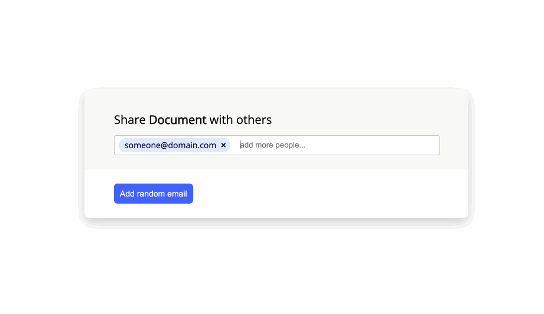

[](https://coveralls.io/github/marcin-pajak/emails-input?branch=master)
[](https://github.com/marcin-pajak/emails-input/actions?query=workflow%3A%22Continuous+Integration%22)

# Emails-Input

Dependency-less library for input, which supports adding and removing multiple
email addresses in an accessible way.



Provides email validation and public API. Allows pasting emails from clipboard
(including multiple emails separated by comma), by pressing `enter` or `,`, or
by losing focus from the input.

Only 3.12KB when minified and gzipped. Works in all major browsers and IE11.

Allows multiple inputs on the same page.

Provides public `init` and `destroy` methods, so it can be integrated with other
frontend libraries like React.

## Installation

### Module version

```sh
npm install @marcin-pajak/emails-input --save
```

You can than import it in your project

```
import EmailsInput from '@marcin-pajak/emails-input'
```

You can also use the provided styles:

```
import '@marcin-pajak/emails-input/lib/styles.css';
```

### UMD version

JavaScript File

```html
<script src="https://cdn.jsdelivr.net/npm/@marcin-pajak/emails-input@latest/lib/index.umd.js"></script>
```

Styles

```html
<link
  rel="stylesheet"
  type="text/css"
  href="https://cdn.jsdelivr.net/npm/@marcin-pajak/emails-input@latest/lib/styles.css"
/>
```

You can then use it in your project

```html
<div id="emails-input" style="max-height: 121px"></div>

<script>
  const element = document.querySelector('#emails-input');
  const instance = EmailsInput(element);
</script>
```

## Usage

```typescript
EmailsInput(element: HTMLElement, userOptions?: Partial<Options>): Library
```

EmailsInput takes two arguments:

1. HTMLElement `element`, where it will be initialized
2. Optional `options`:

```typescript
interface Options {
  initialValue: string[];
  onChange: (changed: string, type: ChangeType, newValue: string[]) => void;
}
```

### initialValue: string[]

List of emails that should be rendered and put on the library's start upon
initialization.

### onChange: (changed: string, type: ChangeType, newValue: string[]) => void

`onChange` callback that will be called every time an email gets added or
removed from the input.

ChangeType represents added or removed action:

```typescript
enum ChangeType {
  Added = 'Added',
  Removed = 'Removed',
}
```

### Returned value

Creating new instance returns publicly available methods and state properties:

```typescript
interface Library {
  // Public State Properties
  emails: string[];
  entries: {
    email: string;
    isValid: boolean;
  }[];

  // Library actions
  destroy: () => void;
  init: () => void;

  // Email actions
  add: (value: string | string[]) => boolean;
  removeByIndex: (index: number) => void;
  removeByName: (name: string) => void;
}
```

### Requirements

Container element should have specified either `height` or `max-height`
property. The library inherits them in its styles.

### Example

```html
<div id="emails-input" style="max-height: 121px"></div>

<script>
  const element = document.querySelector('#emails-input');
  const instance = EmailsInput(element, {
    initialValue: ['some@email.com'],
    onChange: (value, action, emails) => {
      console.log('Changed: ', value);
      console.log('Action type: ', action);
      console.log('Input value: ', emails);
    },
  });

  // Add email via method
  instance.add('other@email.com');
  instance.add('another@email.com, one-more@email.com');

  // Remove email via method
  instance.removeByName('some@email.com');

  // Remove 'other@email.com' email via index
  // Notice we use current index in emails property
  instance.removeByIndex(0);

  // Destroy lib
  instance.destroy();

  // Re-initialize without losing state
  instance.init();

  // Show current emails
  console.log(instance.emails);

  // Get valid emails
  const validEmails = instance.entries
    .filter((entry) => Boolean(entry.isValid))
    .map((entry) => entry.email);
</script>
```

### More examples

Have a look at the examples directory.

See [Vanilla Example](./examples/vanilla-npm/dist/index.html)

## Public API

### Callbacks

#### onChange

```
onChange: (changed: string, type: ChangeType, newValue: string[]) => void;
```

where `ChangeType` indicates action type:

```typescript
enum ChangeType {
  Added = 'Added',
  Removed = 'Removed',
}
```

`onChange`, if passed to library, will be triggered every time email was added
or removed from input.

### State Properties

Creating a new instance of the library returns reference to two state fields:
`emails` and `entries`.

Reference stays the same when input value changes, so these fields are always up
to date with the displayed value.

#### `emails: string[]`

List of all values in the input.

#### `entries: Entry[]`

```typescript
interface Entry {
  email: string;
  isValid: boolean;
}
```

List of all entries in the input. It contains email value and information on
whether or not it's a valid email address.

### Library Methods

#### `init: () => void`

When creating new instance of the library, it will be initialized itself.

This method can be called only when the library has been previously destroyed.

It allows integration with external libraries' life cycle methods.

##### Error

When called while library is already initialized, it will throw
`ERR_INVALID_ACTION`.

#### `destroy: () => void`

When called, it will remove generated HTML and remove all event listeners.

The internal state of the library is kept intact, and when re-initialized, it
will render current input's value and attach all event listeners.

It allows integration with external libraries' life cycle methods.

##### Error

When called while library is already destroyed, it will throw
`ERR_INVALID_ACTION`.

### Email methods

#### `add: (value: string | string[]) => boolean`

Adds unique emails in various formats.

Accepts:

- array of single emails
- string with single email
- string with multiple, comma separated emails

Examples of value:

- `["email@email.com", "email2@email.com"]`
- `"email@email.com, email2@email.com"`
- `"email@email.com"`

Returns `true` if an email was added and `false` if this email is already in the
list.

Triggers onChange callback as follows:

```typescript
onChange(addedEmail: string, ChangeType.Added: ChangeType, state.emails: string[]);
```

In case multiple emails were passed as a value, `onChange` will be called
multiple times, according to the number of emails added to the state.

#### `removeByName: (name: string) => void`

Removes email from the library's state based on its name in `emails` property.

##### Error

When called with invalid index, it throws `ERR_EMAIL_NOT_FOUND`.

#### `removeByIndex: (index: number) => void`

Removes email from the library's state based on its index in `emails` property.

##### Error

When called with invalid index, it throws `ERR_EMAIL_NOT_FOUND`.

## Improvements

- Add public method to reset the state.
- Initialize the library on an input element and update its value with current
  emails.
- Allow specifying `max-height` via options, if not set on the container
  element.
- Allow customizing input's placeholder.
- Document custom styling approach.
- Add e2e tests.
- Automate package publishing.
- Add changelog generation.

## Errors

List of error codes, that should be handled:

```typescript
enum ErrorCodes {
  ERR_INVALID_INITIAL_VALUES,
  ERR_INVALID_ON_CHANGE_CALLBACK,
  ERR_EMAIL_NOT_FOUND,
  ERR_INVALID_ACTION,
  ERR_COULD_NOT_INITIALIZE,
  ERR_INTERNAL,
}
```

Every thrown error has `code` property with one of the above error code.

## Contributing

See [CONTRIBUTING.md](./CONTRIBUTING.md).

## License

The files included in this repository are licensed under the MIT license.
